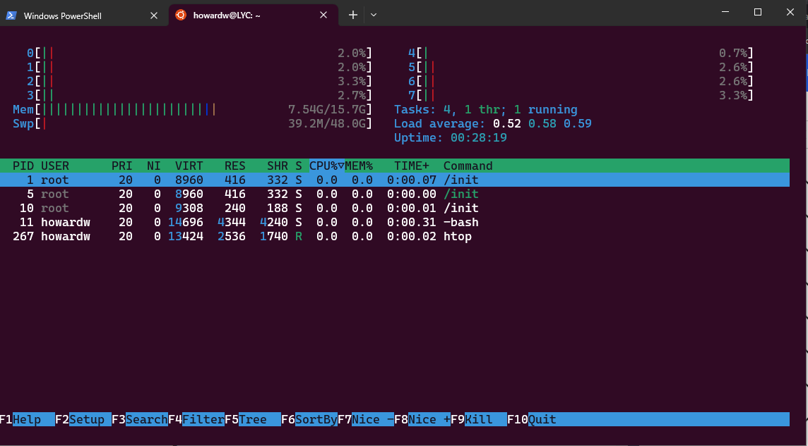

## WSL -Windows Subsystem for Linux

I started by installing the above from the microsoft store.

Than I ran some commands to get familar with Ubuntu 

I run sudo apt upgrade

Nothing to upgrade

Although I had to run the sudo apt upgrade again inoder for me to use the locate  command

upgrading to use locate command

I also notices a few commands where i had to use/add **SUDO** in order for me to exceute the command eg while creating a new user.

Permission denied

Proof of two users added

Finally I used somemore commands eg to check the health of my machine

